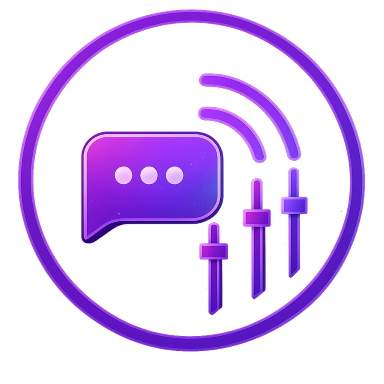

<p align="center">
  
</p>

<h1 align="center">Unified Chat</h1>

<p align="center">
  <strong>Your multistream chat, finally in one place. 🎯</strong><br>
  One unified chat for Twitch, YouTube, and Kick in a single clean feed.
</p><br>
<p align="center">
  👉<a href="https://kimsec.github.io/Unified-chat/">Try the demo here</a>
</p>
<br><p align="center" width="100%">
<a href="https://www.buymeacoffee.com/kimsec">
</a></p>
<p align="center">
  <a href="https://github.com/Kimsec/Stream-Control/releases/latest">
  <a href="https://github.com/Kimsec/Stream-Control">
  </a>
  <a href="https://www.buymeacoffee.com/kimsec">
  </a>
</p>


> 💡 **Just want a multistream chat without any setup?** Try
> [**Unified Chat Lite**](https://unified-chat.com) — free, no login, read-only,
> hosted at unified-chat.com ([source](https://github.com/Kimsec/unified-chat-lite)).
> This repo is the self-hosted edition with moderation, replies and your own tokens.

## What it does

- Reads Twitch chat via EventSub WebSocket
- Reads YouTube live chat via YouTube Live Streaming API
- Reads Kick chat via webhooks
- Displays everything in one feed as `timestamp + platform + Name: Message`
- Twitch and Kick emotes render as inline images
- 7TV / BTTV / FFZ emotes render in Twitch messages (toggle in Settings)
- Animated cheermotes with the bits amount render in Twitch cheer messages
- Twitch badges (broadcaster, mod, sub, VIP...) in front of names (toggle in Settings)
- Mention highlighting, 12/24h clock and chat text size settings
- StreamElements/Streamlabs alert sounds play in the popout and expanded chat
- Settings are stored server-side and sync live to every open view, on any device
- Emote picker for composing messages with your Twitch emotes
- Reply field that sends to Twitch, Kick, or both at once — with per-message
  reply threading (Reply in the name-click panel)
- Popout chat window for a clean, standalone view
- Expand mode: one click fills the window with the chat (`?expand=1` in the URL)
- OBS overlay: `/overlay?token=...` as a transparent Browser source with
  auto-fading messages (`fade=<s>`, `size=<px>`, `align=right`, `max=<n>`, `icons=0`)
- Clear chat button to wipe message history between streams
- Optional password protection for public access (LAN access stays open)
- Stores recent messages in local SQLite for reload/restart

## Prerequisites

Both YouTube and Kick require a **public HTTPS URL** for OAuth callbacks and webhooks — expose your local server (port `8090`) behind a public HTTPS endpoint (e.g. a reverse proxy or Cloudflare Tunnel).

Then set `APP_BASE_URL` in `.env` to that public HTTPS URL. This URL is used to derive the default redirect URIs for YouTube and Kick.

## Quick Start

```bash
cd ~/unified-chat
python3 -m venv venv
. venv/bin/activate
pip install -r requirements.txt
cp .env.example .env
# Fill in your credentials (see sections below)
```

Start the server temporarily (stops when you close the terminal or press `Ctrl+C`):

```bash
venv/bin/uvicorn unified_chat.main:app --host 0.0.0.0 --port 8090
```

Then open your public URL or `http://YOUR_LAN_IP:8090`.

If you want password protection on the UI, set `LOGIN_PASSWORD_HASH` and `SESSION_SECRET_KEY` in `.env`. With auth enabled, `unified-chat` will require login on public hosts such as `unified-chat.domain.com`, but it will still allow direct local/private access on `localhost`, `127.0.0.1`, and LAN IPs like `192.168.x.x` without a password. Keep `SESSION_COOKIE_SECURE=true` for the public HTTPS domain.

---

## Platform Setup

### Twitch

If you already run `stream-control`, you can reuse your existing credentials.

| Variable | Where to find it |
|---|---|
| `TWITCH_CLIENT_ID` | [Twitch Developer Console](https://dev.twitch.tv/console/apps) > Your App > Client ID |
| `TWITCH_BROADCASTER_ID` | Your numeric Twitch user ID (see below) |
| `TWITCH_TOKENS_PATH` | Path to `twitch_tokens.json` managed by stream-control |

**How to find your Twitch Broadcaster ID:**

1. Go to [https://www.streamweasels.com/tools/convert-twitch-username-to-user-id/](https://www.streamweasels.com/tools/convert-twitch-username-to-user-id/)
2. Enter your Twitch username
3. Copy the numeric User ID (e.g. `424350540`)

> Unified Chat reads `twitch_tokens.json` but never writes to it. Token refresh is handled by `stream-control`.
> For the hype train bar and API backfill after refresh/reconnect, the shared token must also include `channel:read:hype_train`. After adding that scope in `stream-control`, re-authorize so Twitch issues a token with the updated scope set.

---

### YouTube

YouTube uses Google OAuth 2.0. You need to create a Google Cloud project and download OAuth credentials. **This is a one-time setup** -- after the initial authorization, tokens refresh automatically and never expire (as long as you follow step 6 below).

#### Step 1: Create a Google Cloud Project

1. Go to [Google Cloud Console](https://console.cloud.google.com/)
2. Click the project dropdown (top-left) > **New Project**
3. Name it something like `Unified Chat` and click **Create**
4. Make sure the new project is selected in the dropdown

#### Step 2: Enable YouTube Data API

1. In the top search bar, search for `YouTube Data API v3`
2. Click the result and press **Enable**

#### Step 3: Configure Branding

After creating the project you'll land on the **Google Auth Platform** page.

1. Click **Branding** in the left sidebar
2. Fill in the required fields:
   - **App name**: `Unified Chat` (or whatever you like)
   - **User support email**: your email
   - **Developer contact email**: your email (scroll to bottom)
3. Click **Save**

#### Step 4: Configure Audience

1. Click **Audience** in the left sidebar
2. Select **External** and click **Save**
3. Under **Test users**, click **+ Add users**
4. Enter the Google/YouTube email address you'll use for streaming
5. Click **Save**

#### Step 5: Add Data Access (Scopes)

1. Click **Data Access** in the left sidebar
2. Click **+ Add or Remove Scopes**
3. Search for `youtube.readonly` and check it
4. Click **Update** then **Save**

#### Step 6: Create OAuth Client

1. Click **Clients** in the left sidebar
2. Click **+ Create Client**
3. Application type: **Web application**
4. Name: `Unified Chat` (or whatever you like)
5. Under **Authorized redirect URIs**, click **+ Add URI** and enter your public URL:
   ```
   https://your-public-domain/auth/youtube/callback
   ```
6. Click **Create**
7. On the client details page, click **Download JSON** (top right)
8. Save the downloaded file as `google-client-secret.json` in the unified-chat project root

#### Step 7: Set .env Variables

```env
APP_BASE_URL=https://your-public-domain
YOUTUBE_CLIENT_SECRETS_FILE=/path/to/unified-chat/google-client-secret.json
```

`YOUTUBE_REDIRECT_URI` defaults to `{APP_BASE_URL}/auth/youtube/callback`, so it will automatically use your public HTTPS URL. You can override it explicitly if needed.

#### Step 8: Publish the App (Makes Tokens Permanent)

> **This is the most important step.** Without this, your refresh token expires after 7 days and you'll need to re-authorize constantly.

1. Click **Audience** in the left sidebar
2. Under **Publishing status**, click **Publish App**
3. Confirm by clicking **Confirm**

You do **not** need Google verification for apps with fewer than 100 users. The app will show an "unverified app" warning during first authorization -- this is normal. Users click **Advanced** > **Go to Unified Chat (unsafe)** to proceed.

#### Step 9: Authorize (One Time Only)

1. Start Unified Chat temporarily:
   ```bash
   cd ~/unified-chat
   venv/bin/uvicorn unified_chat.main:app --host 0.0.0.0 --port 8090
   ```
2. Visit `https://your-public-domain/auth/youtube/start` in your browser
3. Sign in with Google and grant access
4. Done -- tokens are saved and will auto-refresh forever. Press `Ctrl+C` to stop the server.

---

### Kick

Kick uses OAuth 2.0 with webhooks for real-time chat messages. The recommended setup uses **app-token mode** which is fully "set and forget" -- no user authorization needed.

> **Important:** Kick webhooks require a **public HTTPS URL**. If you're running locally, you'll need a reverse proxy or tunnel (e.g. Cloudflare Tunnel, ngrok).

#### Step 1: Create a Kick App

1. Go to [Kick Developer Portal](https://kick.com/settings/developer)
2. Click **Create App**
3. Fill in the required fields:
   - **App name**: `Unified Chat`
   - **Redirect URI**: `https://your-public-domain/auth/kick/callback`
   - **Webhook URL**: `https://your-public-domain/webhooks/kick`
4. Save the app

#### Step 2: Copy Your Credentials

From your Kick app page, copy:
- **Client ID** > paste into `KICK_CLIENT_ID` in `.env`
- **Client Secret** > paste into `KICK_CLIENT_SECRET` in `.env`

#### Step 3: Get Your Broadcaster User ID

You need your numeric Kick user ID for app-token mode.

1. Go to your Kick channel page (e.g. `https://kick.com/yourname`)
2. Open browser DevTools (F12) > Console
3. Run:
   ```js
   fetch('/api/v2/channels/yourname').then(r=>r.json()).then(d=>console.log('User ID:', d.user_id))
   ```
4. Copy the numeric user ID
5. Paste it into `KICK_BROADCASTER_USER_ID` in `.env`

#### Step 4: Set .env Variables

```env
KICK_CLIENT_ID=your_client_id_here
KICK_CLIENT_SECRET=your_client_secret_here
KICK_BROADCASTER_USER_ID=your_numeric_user_id
```

With `KICK_BROADCASTER_USER_ID` set, the app uses **client credentials mode** -- no manual authorization needed. Tokens are generated on-demand and never expire.

> Both the redirect URI and webhook URL use your public HTTPS domain set in `APP_BASE_URL`.

---

## Running as a systemd Service

A ready-to-install unit file is provided in `unified-chat.service` for the current default layout (`/home/<user>/unified-chat` on port `8090`).

```bash
sudo cp unified-chat.service /etc/systemd/system/unified-chat.service
sudo systemctl daemon-reload
sudo systemctl start unified-chat
```

If your username or paths differ, edit `unified-chat.service` first or use `unified-chat.service.example` as a generic template.

`stream-control` can manage `unified-chat.service` automatically, so you do not need to enable it at boot unless you explicitly want it always running.

## Important Limitations

- By default (standalone mode) Unified Chat manages and refreshes its own Twitch token. When used with `stream-control`, leave `TWITCH_CLIENT_SECRET` empty and it reads the shared token read-only (`stream-control` handles refresh)
- Replies go to Twitch and/or Kick (YouTube is read-only)
- Kick replies without a user token are sent by your app's bot identity;
  authorize via `/auth/kick/start` with the `chat:write` scope to send as yourself
- Incoming messages are not cross-posted between platforms
- Kick webhooks require a public HTTPS URL
- Twitch and Kick emotes render as inline images (YouTube messages show as text)
